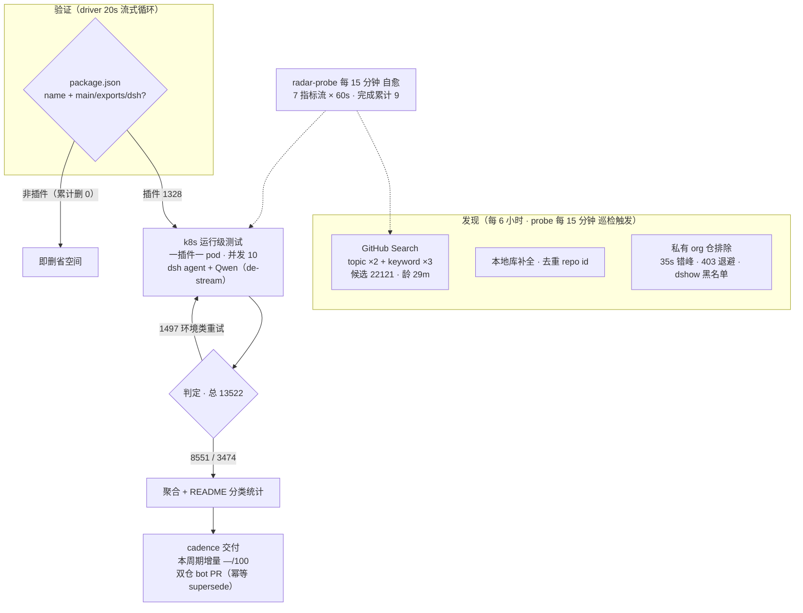

# DSH Plugin Radar

<p align="center">
  <br>
  
</p>

<p align="center">
  <a href="https://trendshift.io/repositories/147500" title="GitHub Trending 日榜 #22 · 2026-08-14 · 全语言口径"></a>
</p>

**开源的 DeepSeek Harness 插件生态雷达——持续发现、运行级验证、15 分钟快照。你看到的插件目录，只是它自动生成的 artifact。**
**An open-source radar for the DeepSeek Harness plugin ecosystem — continuous discovery, runtime validation, 15-minute snapshots. The plugin catalog below is just an artifact it generates.**

安装前就知道哪个能用，不用自己踩坑。
*Know which plugins work before you install them.*

[](#精选插件榜) [](#当前生态快照) [](#本仓库如何判定) [](https://dshfind.com/zh/plugins/AdamPlatin123/dsh-plugin-radar?ref=badge) [](LICENSE)
[](#精选插件榜) [](#当前生态快照) [](#本仓库如何判定) [](https://dshfind.com/zh/plugins/AdamPlatin123/dsh-plugin-radar?ref=badge) [](LICENSE)

[](#2-看懂状态统一四档口径) [](#2-看懂状态统一四档口径) [](#2-看懂状态统一四档口径)


[](#2-看懂状态统一四档口径) [](#2-看懂状态统一四档口径) [](#2-看懂状态统一四档口径)

[](#2-看懂状态统一四档口径) [](#2-看懂状态统一四档口径) [](#2-看懂状态统一四档口径)

---

**这是什么？** DeepSeek Harness（DSH）是一个万物皆插件的编码 agent。本仓库是自动追踪其插件生态的**雷达**——索引、克隆验证并运行级实测。
**What is this?** DeepSeek Harness (DSH) is an open-source coding agent where everything is a plugin. This repo is a **radar** that automatically tracks its plugin ecosystem — indexing, clone-verifying and runtime-testing it.

**架构原则：目录是构建产物（Catalog is a build artifact）。**
**Architecture principle: the catalog is a build artifact.**

```text
Radar Engine（开源 → engine/）          Radar Engine (open-source → engine/)
     ↓                                        ↓
机器可读快照（每 15 分钟）              Machine-readable snapshots (every 15 min)
     ↓                                        ↓
目录渲染器（聚合 · 分类 · 双语渲染）     Catalog renderer (aggregation · classification · bilingual rendering)
     ↓                                        ↓
┌─ PLUGINS-ALL.md 全量清单 / full listing
├─ 精选插件榜 / 整合包   Featured board / bundles
├─ 生态快照 / 兼容矩阵   Ecosystem snapshot / compatibility matrix
└─ dshfind 等下游消费方  dshfind & downstream consumers
```

## 工作原理
> 数据截至快照 `20260918T214501Z`（2026-09-19 05:45:03 UTC+8 · 分类器 unified-v2-bridge）
> *Data as of snapshot — currently `20260918T214501Z` (2026-09-19 05:45:03 UTC+8 · classifier unified-v2-bridge)*
*How It Works*

<!-- AUTO:pipeline:START -->

<!-- AUTO:pipeline:END -->

**🔌 开源计划——本页数据由「DSH 插件雷达」服务管线自动生产，雷达源码分阶段开源：**
**🔌 Open-Source Plan — this page is produced automatically by the radar pipeline, open-sourced in stages:**

| 阶段 / Phase | 开源内容 / Content | 状态 / Status |
|---|---|---|
| Phase 1 | 管线文档 / Pipeline docs：[总览与路线图](docs/radar/overview.md) · [架构](docs/radar/architecture.md) · [数据契约](docs/radar/data-contracts.md) | ✅ 已开源 / Open |
| Phase 2 | 雷达引擎源码 / Radar engine source（发现 · 聚合 · 渲染 · 分发 + 运维自愈 / discovery · aggregation · rendering · distribution + ops） | ✅ 已开源 → [engine/](engine/) |
| Phase 3 | 测试引擎源码 / Test engine source：轻量版（本地直跑 / local, no k8s）· 服务器版（k8s 集群 / server edition） | 🔜 稳定后开源 / After stabilization |

## 快速导航
*Quick Start*

| 你的目标 / Goal | 跳转入口 / Link |
|---|---|
| 了解这个雷达本身 / Understand the radar | [工作原理](#工作原理) · [开源引擎 engine/](engine/) · [管线文档](docs/radar/overview.md) |
| 看精选插件 / Browse featured | [精选插件榜](#精选插件榜) — 人工策展 · 11 类 / curated · 11 categories |
| 一把装好 / Install a bundle | [整合包](#-整合包) — 预设 / 合集 / 发行版 / 配方 / presets · collections · distributions · recipes |
| 市场接入 / For marketplaces | [数据接口 docs/api.md](docs/api.md) — 稳定 JSON · 署名即用 / stable JSON, attribution only |
| 按用途找插件 / Find by use case | [分类目录](#分类目录) — 13 类 · 明细见 [PLUGINS-ALL.md](PLUGINS-ALL.md) · [PLUGINS.md](PLUGINS.md) 为登记清单 |
| 浏览全部发现 / All discovered repos | [当前生态快照](#当前生态快照) — 日期化兼容矩阵 / dated compatibility matrix |
| 登记或提交插件 / Register a plugin | [给插件开发者](#给插件开发者) · 加 `dsh-plugin` topic → 8h 自动收录 / auto-discovered in 8h |
| 了解最近变更 / Recent changes | [CHANGELOG](CHANGELOG.md) |
| 加入社群 / Join the community | [DSH 学习社区](#dsh-学习社区-dshfindcom) · [社区讨论群](#社区讨论群) |

> [!IMPORTANT]
> **收录不等于兼容，静态检查不等于运行可用，运行可用也不等于安全审计。**
> **Inclusion ≠ compatible, static check ≠ runtime-usable, runtime-usable ≠ security-audited.**
> 本仓库提供可追溯的筛选信号，不代表 DSH 官方背书。安装第三方插件前，请检查源码、权限、依赖、许可证及测试日期。
> *This repo provides traceable filtering signals, not official DSH endorsement. Always review plugin source, permissions, dependencies, and license before installing.*

## 🛒 生态目录（雷达生成的 artifact）
*Ecosystem Catalog — an artifact generated by the radar*

以下目录内容——精选榜、整合包、分类目录、兼容矩阵——均由雷达管线自动生产与刷新（精选榜与整合包成员为人工策展，星标与状态由 bot 持续更新）。
*Everything catalog-shaped below is produced and refreshed by the radar pipeline (featured/bundle membership is human-curated; stars and statuses are kept fresh by bots).*

数据接口与下游接入见 **[🤝 市场与下游接入](#-市场与下游接入欢迎引用可用性数据)**。
*For the data API and downstream integration see **[🤝 For Marketplaces](#-市场与下游接入欢迎引用可用性数据)**.*

<details>
<summary><b>📖 展开生态目录 / Expand ecosystem catalog</b></summary>

### 精选插件榜
*Featured Board*

<!-- AUTO:featured:START -->

> 人工策展 55 款插件，按 11 类分组、类内按星标排序；星标每 6 小时自动刷新（成员调整请提 PR 修改 data/awesome-50.json）。数据截至 2026-09-24 05:35（UTC+8）。
> *Human-curated 55 plugins in 11 groups, star-sorted within each; stars auto-refresh every 6 hours (membership via PR to data/awesome-50.json). As of 2026-09-24 05:35 (UTC+8).*

### 🚀 智力增强 Booster（7）
*Intelligence Boosters (7)*

-  **[dsh-routing-suite](https://github.com/yjh051108/dsh-routing-suite)** · 7207★ — 注入器 × 思维模式路由套装：免重启运行时注入器 + 任务感知推理模式路由预设（P1-P23 实测）
-  **[ouroboros](https://github.com/Q00/ouroboros)** · 6081★ — Agent OS：agent 自我变强、人只守底线——自进化运行时（5.7k★；rc.8 实测 ✅）
-  **[harmony-next.skills](https://github.com/linhay/harmony-next.skills)** · 354★ — 技能驱动的工作流增强
-  **[superpowers-dsh](https://github.com/LayneChai/superpowers-dsh)** · 93★ — TDD/调试/计划等开发技能集
-  **[forkprobe](https://github.com/Jayden-X-L/forkprobe)** · 72★ — 同一任务跑多个技能对比，自动选优
-  **[dsh-tool-turbo](https://github.com/Electricitysheep/dsh-tool-turbo)** · 8★ — 按轮次自动优化 reasoning_effort（推理力度）
-  **[dsh-reasoning-settings](https://github.com/JuneLearn/dsh-reasoning-settings)** · 5★ — 推理设置控制：让模型按任务切换思考档位

### 🖥 界面与工作台（6）
*UI & Workbench (6)*

-  **[dsh-web-ui](https://github.com/zhu1090093659/dsh-web-ui)** · 7963★ — Web UI 增强与皮肤合集：任务看板、Git 图、移动端、皮肤中心
-  **[DSH-better-sidebar](https://github.com/omdsh-dev/DSH-better-sidebar)** · 3731★ — 侧边栏变完整工作台：文件编辑/终端/Git/子代理，支持三方注册扩展页
-  **[dsh-genui](https://github.com/omdsh-dev/dsh-genui)** · 475★ — GenUI 内联组件：图表/表单/测验/3D 场景 + action 事件环
-  **[dsh-visualize](https://github.com/Nagi-ovo/dsh-visualize)** · 264★ — 对话中生成交互式可视化卡片
-  **[dsh-annotation](https://github.com/omdsh-dev/dsh-annotation)** · 128★ — 划选文字→批注→随消息发送，回复逐条对照
-  **[Liang-Saint-Slider](https://github.com/BruzWJ/Liang-Saint-Slider)** · 95★ — 模型与思考力度选择滑条

### ⌨️ 终端与桌面端（5）
*Terminal & Desktop (5)*

-  **[dsh-desktop](https://github.com/anywhere-labs/dsh-desktop)** · 28699★ — 生态最高星桌面客户端（21.5k★，原 deepseek-harness-desktop 再改名）：万物皆插件、桌面本身也是插件（雷达重测中；rc.8 源码路径实测 ✅）
-  **[deepseek-harness-desktop](https://github.com/hairyf/deepseek-harness-desktop)** · 2553★ — Tauri 桌面版：5MB 安装包零环境配置，Win/macOS/Linux
-  **[oh-dsh](https://github.com/hust-open-atom-club/oh-dsh)** · 321★ — 社区发行版：桌面/Web/TUI 三形态统一体验
-  **[Bigfish](https://github.com/turtle2209/Bigfish)** · 319★ — 第三方桌面端：内置 Node 运行时，双击即用
-  **[dsh-tianshu-tui](https://github.com/huiliyi37/dsh-tianshu-tui)** · 283★ — 自研 ANSI 渲染的极简终端 UI

### 👁 视觉与多模态（4）
*Vision & Multimodal (4)*

-  **[modlens](https://github.com/liustack/modlens)** · 4020★ — 生态第一个视觉插件，视觉工作流的基准方案
-  **[agent-vision-toolkit](https://github.com/Anionex/agent-vision-toolkit)** · 1209★ — 通用 agent 视觉工具箱：多图理解/图片问答/前端 UI 还原/GUI 自动化（dsh-vision-toolkit 同作者）
-  **[dsh-vision-router](https://github.com/ysr666/dsh-vision-router)** · 1116★ — 内置免费视觉模型路由，给文本 agent 装眼睛
-  **[dsh-vision-toolkit](https://github.com/Anionex/dsh-vision-toolkit)** · 883★ — 带意图图片问答、长截图 OCR、UI 还原

### 🤖 Agent 能力与编排（7）
*Agent Orchestration (7)*

-  **[distilly](https://github.com/titanwings/distilly)** · 24993★ — 把专家思维蒸馏为可复用 Skills 的平台（24k★，Agent 域之最，原名 colleague-skill；雷达判可用）
-  **[dsh-agent-teams](https://github.com/NanmiCoder/dsh-agent-teams)** · 1786★ — 多代理团队编排
-  **[helloagents](https://github.com/hellowind777/helloagents)** · 704★ — agent 能力合集
-  **[sandbase-harness](https://github.com/sandbaseai/sandbase-harness)** · 651★ — CMA 兼容开源 agent 运行时，任意模型可驱动
-  **[rea](https://github.com/morluto/rea)** · 414★ — 用 agent 逆向工程任何东西：从应用行为到原生二进制
-  **[open-record-replay](https://github.com/humblebanana/open-record-replay)** · 144★ — macOS 录制回放：把鼠标/键盘/UI 事件存为结构化轨迹供 agent 学习重放
-  **[axern](https://github.com/cofy-x/axern)** · 67★ — AI agent 开源沙箱：不可信代码执行与持久服务

### 💻 编码与生产力（5）
*Coding & Productivity (5)*

-  **[TokenTracker](https://github.com/xiufengsun/TokenTracker)** · 1706★ — 本地优先的 31 种编码工具 token 用量与成本追踪
-  **[api-relay-audit](https://github.com/toby-bridges/api-relay-audit)** · 856★ — AI API 中继/LLM 代理本地安全审计，产出 Markdown 报告（rc.8 实测 ✅）
-  **[claude-paper](https://github.com/alaliqing/claude-paper)** · 338★ — 跨 agent 论文工具箱：速读摘要/深度研读材料/代码演示 + 本地 Web 阅读器
-  **[mobius](https://github.com/nutshellai-tech/mobius)** · 296★ — 编码增强
-  **[dsh-remote](https://github.com/flymysql/dsh-remote)** · 98★ — 多机远程工作区：SSH 连接管理、远程目录→本地镜像→原生工作区收养、SFTP 双向同步与 rw_* 工具族

### 🧠 记忆与上下文（3）
*Memory & Context (3)*

-  **[EverOS](https://github.com/EverMind-AI/EverOS)** · 13161★ — 全 agent 便携记忆层：本地优先、Markdown-native（12.4k★ 记忆域之最；rc.8 实测 ✅）
-  **[mnemon](https://github.com/mnemon-dev/mnemon)** · 592★ — 跨 agent、本地优先的持久记忆
-  **[dsh-memory-evolve](https://github.com/csyangwen/dsh-memory-evolve)** · 328★ — 五轨记忆 + git 分支托管 + 后台自我进化

### 📡 消息通讯与 IM（4）
*Messaging & IM (4)*

-  **[dsh-lark](https://github.com/omdsh-dev/dsh-lark)** · 56★ — 飞书 IM bot 频道（官方渠道插件）
-  **[dsh-message-edit](https://github.com/Moeblack/dsh-message-edit)** · 49★ — 分支式消息编辑、reroll、重试、多版本
-  **[dsh-interconnect](https://github.com/Chinesezjc/dsh-interconnect)** · 33★ — 跨 DSH 实例消息/事件交接
-  **[ChatCCC](https://github.com/wzj998/ChatCCC)** · 22★ — 飞书/微信聊天控制 DSH / Claude Code

### 🗂 文件、数据与浏览（4）
*Files, Data & Browsing (4)*

-  **[dsh-browser](https://github.com/Lum1104/dsh-browser)** · 722★ — Chrome 侧栏扩展，让 DSH 直接操作浏览器
-  **[dsh-openpencil](https://github.com/ZSeven-W/dsh-openpencil)** · 178★ — OpenPencil 设计稿预览与编辑
-  **[dsh-web-search-pro](https://github.com/anweat/dsh-web-search-pro)** · 70★ — 增强型持久网页搜索
-  **[dsh-plugin-mineru](https://github.com/HuanLinOTO/dsh-plugin-mineru)** · 47★ — PDF/图片/Office 转结构化 Markdown

### 🛒 市场与管理（4）
*Marketplaces & Management (4)*

-  **[dsh-market](https://github.com/dsh-market/dsh-market)** · 4445★ — 持续收录 1000+ 插件的市场：中文搜索 + 五维评分
-  **[dsh-web-plugin-manager](https://github.com/LX2000WASD/dsh-web-plugin-manager)** · 71★ — Web UI 一键管理插件：启停/装卸/环境管理
-  **[dsh-plugin-check](https://github.com/omdsh-dev/dsh-plugin-check)** · 26★ — 插件健康检查：清单协议/patch 格式/构建陷阱
-  **[deepseek-plugin-store](https://github.com/Ericwong5021/deepseek-plugin-store)** · 24★ — 独立社区插件商店：发现/安装/提交经验证的插件

### 🎮 娱乐生活（6）
*Fun & Life (6)*

-  **[petdex](https://github.com/crafter-station/petdex)** · 4152★ — 生态最高星桌宠图鉴
-  **[dsh-deep-whale](https://github.com/Small-tailqwq/dsh-deep-whale)** · 2191★ — 深海鲸鱼养成
-  **[openpets](https://github.com/alvinunreal/openpets)** · 1231★ — 本地优先桌面伴侣平台：动画宠物 + 插件 SDK（娱乐域第二位）
-  **[dsh-ads](https://github.com/Nagi-ovo/dsh-ads)** · 633★ — 把 DSH 变回 2005 门户网站：怀旧广告/小游戏/弹窗
-  **[whale-girl](https://github.com/vlln/whale-girl)** · 333★ — QQ 宠物形态桌宠：可拖拽/投喂/玩耍
-  **[dsh-kun-like-pet](https://github.com/liyupi/dsh-kun-like-pet)** · 96★ — 小坤桌宠：随 Agent 工作状态切换 9 种动作

> 兼容状态磁贴 = 雷达 k8s 运行级判定（🟩 已兼容 · 🟨 需适配 · ⬜ 待测试，三态等宽；四档口径见下文），右半为该轮 runner 测试版本，**由 bot 按最新快照自动回写**，榜内成员走插队重测通道优先轮测；安装第三方插件前请审查源码并固定 commit。
> *Status tiles = radar k8s runtime verdicts (🟩 compatible · 🟨 needs-adaptation · ⬜ to-test); the right segment carries the runner version — both auto-updated from the latest snapshot. Always review plugin source and pin a commit before installing.*

<!-- AUTO:featured:END -->

## 📦 整合包
*Bundles*

<!-- AUTO:bundles:START -->

> 人工策展 16 个整合包：内测成员作品置顶，其下按预设套件 / 能力合集 / 发行版 / 配方管理器四形态分组，类内按星标排序；星标每 6 小时自动刷新（成员调整请提 PR 修改 data/bundles.json）。数据截至 2026-09-24 05:35（UTC+8）。
> *Human-curated 16 bundles: insider picks pinned on top, then presets / collections / distributions / recipe managers, star-sorted; auto-refreshed every 6 hours. As of 2026-09-24 05:35 (UTC+8).*

### ⭐ 内测成员作品（1）
*Insider Members (1)*

-  **[marisa-distro](https://github.com/LoserFox/marisa-distro)** · 12★ — 魔理沙整合发行版（内测成员作品）：DSH 0.1.0-rc.7 + 桌面壳 + 29 个插件 + MyGO 插件市场，Windows MSI/便携版/profile 三形态安装（v0.1.11，Release 带 SHA256 校验）

### 🎚 预设与配置套件（4）
*Presets & Config Kits (4)*

-  **[dsh-routing-suite](https://github.com/yjh051108/dsh-routing-suite)** · 7207★ — 注入器 × 思维模式路由套装：免重启运行时注入器 + P1-P23 任务感知推理模式路由（rc.8 实测 ✅）
-  **[dsh-anchored-standard](https://github.com/xiaobright/dsh-anchored-standard)** · 3799★ — 两阶段预设：极简模式对齐启动 → 全量装载（rc.8 实测 ✅）
-  **[dsh-gitbash-preset](https://github.com/liceses/dsh-gitbash-preset)** · 129★ — Windows 一键「极简模式 Git Bash」预设：把自带极简模式的 bash 调用映射到 Git Bash
-  **[dsh-roleplay-preset](https://github.com/oliblue-evan/dsh-roleplay-preset)** · 23★ — 沉浸式角色扮演预设：零工具纯对话、酒馆式演出格式、文件记忆库

### 🧩 能力合集（8）
*Capability Collections (8)*

-  **[Aegis](https://github.com/GanyuanRan/Aegis)** · 1262★ — 软件工程方法论技能包：baseline-first 规划、系统性重构（rc.8 实测 ✅）
-  **[helloagents](https://github.com/hellowind777/helloagents)** · 704★ — agent 能力合集（rc.8 实测 ✅）
-  **[DeepSec](https://github.com/Unclecheng-li/DeepSec)** · 443★ — AI 安全攻防一体化合集：Android · Web · Native · 协议 · 恶意代码 · AI 六域
-  **[harmony-next.skills](https://github.com/linhay/harmony-next.skills)** · 354★ — 技能驱动的工作流增强（rc.8 实测 ✅）
-  **[dsh-reverse-skill](https://github.com/dhicoc/dsh-reverse-skill)** · 165★ — 完整逆向工程技能合集（85 个 SKILL.md）
-  **[superpowers-dsh](https://github.com/LayneChai/superpowers-dsh)** · 93★ — TDD/调试/计划等开发技能集（rc.8 实测 ✅）
-  **[dsh-daily-kit](https://github.com/zhouwei713/dsh-daily-kit)** · 1★ — 日常插件集合：16 插件 monorepo + 4 bundle，含 596 单测
-  **[dsh-plugins](https://github.com/MkaliezZ/dsh-plugins)** · 0★ — DSH 插件家族索引：agentfuse / evidence-task-board / test-normalizer 等 16 插件合集（monorepo）

### 📀 发行版（2）
*Distributions (2)*

-  **[oh-dsh](https://github.com/hust-open-atom-club/oh-dsh)** · 321★ — 社区发行版：桌面/Web/TUI 三形态统一体验
-  **[Bigfish](https://github.com/turtle2209/Bigfish)** · 319★ — 第三方桌面端发行版：内置 Node 运行时，双击即用（雷达判需适配——发行版形态非单插件安装）

### 📑 配方管理器（1）
*Recipe Managers (1)*

-  **[dsh-recipe](https://github.com/863683348/dsh-recipe)** · 0★ — 场景配方管理器（插件界的 dotfiles）：列出/搜索/安装插件组合（形态稀缺，豁免星标门槛）

> 磁贴口径同精选榜（三态 · 右半 runner 版本）；整合包安装方式以各仓库 README 为准（预设类多为 `dsh plugin add` 后在设置中启用，发行版类需按其自身安装器操作）。
> *Tiles follow the same scheme as the featured board; install per each bundle's own README (presets: `dsh plugin add` then enable in settings; distributions: use their installers).*

<!-- AUTO:bundles:END -->

## 分类目录
*Plugin Catalog*

<!-- AUTO:catalog:START -->

逐插件明细（判定 · 定位 · 星标）按域分页见 **[PLUGINS-ALL.md](PLUGINS-ALL.md)** 索引。

- **🎓 技能包**（31）— 可用 7 · 不兼容 2 · 待定 6 · 未测 13 · 监测 3 — [明细](catalog/all/技能包.md)
- **🧠 记忆增强**（48）— 可用 15 · 不兼容 5 · 待定 4 · 未测 2 · 监测 22 — [明细](catalog/all/记忆增强.md)
- **🎨 主题皮肤**（25）— 可用 12 · 不兼容 1 · 待定 2 · 未测 7 · 监测 3 — [明细](catalog/all/主题皮肤.md)
- **🛒 市场与管理**（322）— 可用 97 · 不兼容 29 · 待定 17 · 未测 12 · 监测 167 — [明细](catalog/all/市场与管理.md)
- **🔌 Web UI 增强**（2833）— 可用 1309 · 不兼容 503 · 待定 207 · 未测 18 · 监测 796 — [明细](catalog/all/Web%20UI%20增强.md)
- **💻 编码开发**（2207）— 可用 885 · 不兼容 429 · 待定 168 · 未测 23 · 监测 702 — [明细](catalog/all/编码开发.md)
- **🤖 Agent 能力**（2352）— 可用 801 · 不兼容 361 · 待定 143 · 未测 14 · 监测 1033 — [明细](catalog/all/Agent%20能力.md)
- **📡 消息通讯**（749）— 可用 248 · 不兼容 141 · 待定 48 · 未测 6 · 监测 306 — [明细](catalog/all/消息通讯.md)
- **🗂 文件数据**（701）— 可用 268 · 不兼容 115 · 待定 53 · 未测 9 · 监测 256 — [明细](catalog/all/文件数据.md)
- **🎮 娱乐生活**（461）— 可用 172 · 不兼容 48 · 待定 22 · 未测 0 · 监测 219 — [明细](catalog/all/娱乐生活.md)
- **🛠 基建部署**（1393）— 可用 426 · 不兼容 166 · 待定 115 · 未测 7 · 监测 679 — [明细](catalog/all/基建部署.md)
- **📚 学习研究**（166）— 可用 34 · 不兼容 13 · 待定 8 · 未测 2 · 监测 109 — [明细](catalog/all/学习研究.md)
- **❓ 其他**（7535）— 可用 1835 · 不兼容 445 · 待定 232 · 未测 23 · 监测 5000 — [明细](catalog/all/其他.md)

<!-- AUTO:catalog:END -->

</details>

## 🤝 市场与下游接入（欢迎引用可用性数据）
*For Marketplaces — reference our compatibility data*

插件市场、聚合站与社区清单（dsh-market、dshfind、awesome 列表等）**欢迎直接引用本雷达的运行级可用性数据**——两个稳定 JSON 接口，无需申请、署名即可：
*Plugin marketplaces and aggregators are **welcome to consume this radar's runtime-verdict data** — two stable JSON endpoints, no key required, attribution appreciated:*

```python
d = json.load(urllib.request.urlopen(
    "https://raw.githubusercontent.com/AdamPlatin123/dsh-plugin-radar/main/data/plugins-all.json"))
verdict = {p["repo"]: p["verdict"] for p in d["plugins"]}
```

三态磁贴资产可热链、动态徽章端点 schema、口径与署名规范见 **[docs/api.md](docs/api.md)**。
*Hotlinkable status tiles, dynamic badge schema, and attribution rules: **[docs/api.md](docs/api.md)**.*

##  DSH 学习社区 dshfind.com
*DSH Learning Community*

[dshfind.com](https://dshfind.com) — DSH 原理学习、插件市场与最佳实践社区：从 Cordis 论文逐章精读到插件自动聚合市场。
*[dshfind.com](https://dshfind.com) — community for DSH internals, plugin marketplace and best practices.*

## 社区讨论群
*Community Discussion Group*

DSH 插件社区讨论群（微信群）：插件作者、维护者与使用者都在这里。
*WeChat group for plugin authors, maintainers and users.*


> 当前为「DSH-Plugins 社区交流 3 群」二维码，7 天内有效（2026-09-23 前），过期请联系群主换新。
> *Currently the QR for community group #3 — expires 2026-09-23; contact the owner for a fresh one afterwards.*

## 给插件使用者
*For Plugin Users*

### 1. 找到候选插件 / Find candidates

- 优先浏览[分类目录](#分类目录)与逐插件明细 [PLUGINS-ALL.md](PLUGINS-ALL.md)——自动发现并经运行级实测的全量清单。
- *Browse the [Plugin Catalog](#分类目录) and per-plugin details in [PLUGINS-ALL.md](PLUGINS-ALL.md) — the auto-discovered, runtime-tested full listing.*
- [PLUGINS.md](PLUGINS.md) 是经 PR 登记的社区登记清单，与自动发现互补。
- *[PLUGINS.md](PLUGINS.md) is the PR-registered community list, complementary to auto-discovery.*

### 2. 看懂状态（统一四档口径） / Understand status (unified 4-tier scale)

全部条目使用**单一运行级口径**（k8s 容器实测），四档互斥：
*All entries use a **single runtime scale** (k8s container tests), four mutually exclusive tiers:*

| 状态 / Status | 它说明什么 / Says | 它不说明什么 / Doesn't say |
|---|---|---|
| 运行级可用 / runtime OK | 在记录的测试版本下真实加载并完成验证任务 / Really loaded and completed a probe task under the recorded version | 不是完整功能测试、性能测试或安全审计 / Not a full functional, performance, or security audit |
| 运行级不兼容 / incompatible | 依赖装不上、缺内部包等硬失败（3 次重试全败）/ Hard failures (install broken, missing internals) after 3 retries | 不代表永远不可用；作者可能已修复 / Not forever-broken; may already be fixed |
| 待定 / pending | 测试环境故障，未完成判定 / Environment failure, inconclusive | 不是部分兼容 / Not "partially compatible" |
| · 未测 / untested | 尚未派发运行级测试 / Not yet dispatched | 不应推断兼容或不兼容 / No inference either way |

> [!NOTE]
> 每个结论都应同时看四项：**插件 commit、mainline commit、测试日期、测试层级**。
> *Every verdict should be read together with: **plugin commit, mainline commit, test date, and test tier**.*

### 3. 安装、验证和回滚 / Install, verify, roll back

1. 阅读插件的安装、配置、权限和卸载说明；固定版本或 commit。
   *Read install/config/permission/uninstall docs; pin a version or commit.*
2. 先在隔离 profile 或测试环境加载，不提供生产密钥。
   *Load in an isolated profile or test env first; never hand over production credentials.*
3. 执行一个最小功能任务，记录 DSH 版本、插件版本和日志；保留回滚路径。
   *Run one minimal task, record versions and logs; keep a rollback path.*

## 给插件开发者
*For Plugin Developers*

### 最低收录条件 / Minimum inclusion

- 仓库公开可访问，添加 `dsh-plugin` topic；声明支持的 DSH 版本或已验证 commit。
- *Public repo with the `dsh-plugin` topic; declare supported DSH version or verified commit.*
- 一个合格的 README 至少包含：功能、安装方式、权限范围、许可证。
- *A proper README at least covers: what it does, install steps, permission scope, license.*

### 提交插件 / Submit

加 topic 后 8 小时内自动收录；或直接向 [PLUGINS.md](PLUGINS.md) 提 PR（[PR 模板](.github/PULL_REQUEST_TEMPLATE.md)）。
*Auto-discovered within 8 hours of adding the topic; or open a PR to [PLUGINS.md](PLUGINS.md) ([template](.github/PULL_REQUEST_TEMPLATE.md)).*

## 本仓库如何判定
*How We Assess Compatibility*

- **静态清单检查**（名称、入口、manifest）只决定是否进入测试队列。
  *Static manifest checks only gate entry into the test queue.*
- **运行级实测**在 k8s 集群上进行：一插件一 pod、隔离文件系统与网络，以当前 DSH 版本执行标准安装与验证任务。
  *Runtime tests run on a k8s cluster: one pod per plugin, isolated fs/network, standard install + probe task under the current DSH version.*
- **基础设施故障与插件故障严格分离**：网络/磁盘/权限故障标记为环境类并重试，不计入插件失败。
  *Infra failures and plugin failures are strictly separated: environment issues are retried, never counted against the plugin.*
- 判定数据与逐轮快照见 `data/`；引擎源码见 [engine/](engine/)。
  *Verdict data and per-round snapshots live in `data/`; engine source in [engine/](engine/).*

## 仓库结构
*Repo Layout*

```text
engine/            雷达引擎源码（发现·聚合·渲染·分发·运维）/ radar engine source
data/snapshots/    机器可读快照（每 15 分钟）/ machine-readable snapshots
catalog/all/       按域分页的插件明细 / per-domain plugin listings
PLUGINS-ALL.md     全量清单索引 / full-listing index
PLUGINS.md         PR 登记清单 / PR-registered list
docs/api.md        数据接口（市场接入）/ data API for marketplaces
docs/radar/        管线文档 / pipeline docs
```

## 当前生态快照
*Ecosystem Snapshot*

<!-- AUTO:ecosystem:START -->
> 渲染于快照 `20260916T021501Z`（2026-09-16 10:15:03）· 数据源 data/snapshots/（渲染即对齐）
> *Rendered from snapshot — data/snapshots/ (render-time aligned)*

| 证据层 / Evidence | 当前结果 / Result |
|---|---:|
| 自动收录 / Auto-indexed | 1300 个仓库 / repos |
| 运行级实测 | 8551 可用 · 3474 不兼容 · 1497 待定（共 13522 个，k8s agent 口径）|

[完整索引](PLUGINS-ALL.md) · [运行实测](reports/2026-08-27/agent-test-v2.md)
<!-- AUTO:ecosystem:END -->

## 项目边界与致谢
*Scope & Credits*

- 本仓库是社区项目，与 DeepSeek 官方无隶属关系；插件判定不代表官方背书。
  *A community project, not affiliated with DeepSeek; verdicts are not official endorsements.*
- 感谢 DSH 社区与所有插件作者。*Thanks to the DSH community and all plugin authors.*
